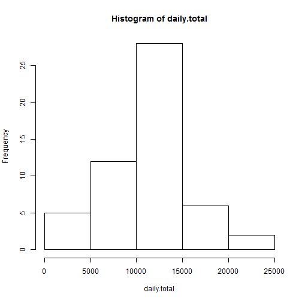
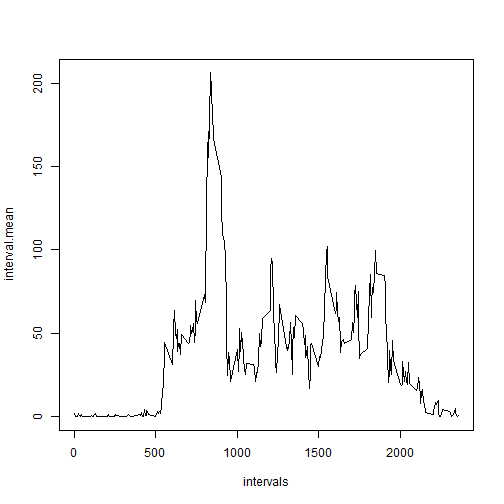
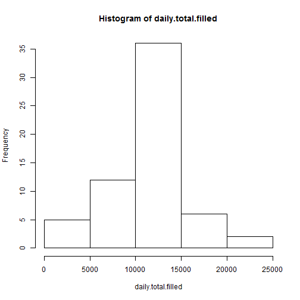
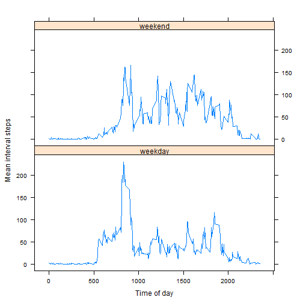

## Loading and preprocessing the data

First, load the csv:


```r
data <- read.csv(unz("activity.zip", "activity.csv"))
summary(data)
```

```
##      steps                date          interval     
##  Min.   :  0.00   2012-10-01:  288   Min.   :   0.0  
##  1st Qu.:  0.00   2012-10-02:  288   1st Qu.: 588.8  
##  Median :  0.00   2012-10-03:  288   Median :1177.5  
##  Mean   : 37.38   2012-10-04:  288   Mean   :1177.5  
##  3rd Qu.: 12.00   2012-10-05:  288   3rd Qu.:1766.2  
##  Max.   :806.00   2012-10-06:  288   Max.   :2355.0  
##  NA's   :2304     (Other)   :15840
```

Use the `date` and `interval` columns to construct a `datetime` column:


```r
data$datetime <- as.POSIXlt(sprintf("%s %04i", data$date, data$interval), tz="UTC", format="%Y-%m-%d %H%M")
head(data$datetime)
```

```
## [1] "2012-10-01 00:00:00 UTC" "2012-10-01 00:05:00 UTC"
## [3] "2012-10-01 00:10:00 UTC" "2012-10-01 00:15:00 UTC"
## [5] "2012-10-01 00:20:00 UTC" "2012-10-01 00:25:00 UTC"
```


## What is mean total number of steps taken per day?

First, calculate the total number of steps per day:


```r
daily.total <- unlist(aggregate(data$steps~data$date, FUN=sum)[2])
```

Next, generate a histogram:


```r
hist(daily.total)
```

 

Next, calculate the mean and medium total daily steps:


```r
mean(daily.total)
```

```
## [1] 10766.19
```

```r
median(daily.total)
```

```
## [1] 10765
```

## What is the average daily activity pattern?


```r
intervals <- unique(data$interval)
interval.labels <- sprintf('%02i:%02i', intervals / 100, intervals %% 100)
interval.mean <- unlist(aggregate(data$steps~data$interval, FUN=mean)[2])
plot(intervals, interval.mean, type='l')
```

 

The 5-minute interval with the highest number of steps on average is 08:35:

```r
interval.labels[which.max(interval.mean)]
```

```
## [1] "08:35"
```


## Imputing missing values

There are 2304 missing intervals which corresponds to 8 days:

```r
sum(is.na(data$steps))
```

```
## [1] 2304
```

```r
missing.days <- as.character(unique(data$date[is.na(data$steps)]))
missing.days
```

```
## [1] "2012-10-01" "2012-10-08" "2012-11-01" "2012-11-04" "2012-11-09"
## [6] "2012-11-10" "2012-11-14" "2012-11-30"
```

We will create a second data set, where missing days are populated with the average number of steps for that interval taken from other days. The strategy is to loop through all 288 intervals, construct an index which applies to that interval for all missing days, and assign it the interval's mean value:


```r
data.filled <- data
for (interval in intervals) {
    index <- data.filled$interval == interval & data.filled$date %in% missing.days
    data.filled$steps[index] <- interval.mean[intervals == interval]
}
```

Now we plot a histogram like before, this time with missing values imputed, also showing the new mean and median:


```r
daily.total.filled <- unlist(aggregate(data.filled$steps~data$date, FUN=sum)[2])
hist(daily.total.filled)
```

 

```r
mean(daily.total.filled)
```

```
## [1] 10766.19
```

```r
median(daily.total.filled)
```

```
## [1] 10766.19
```

## Are there differences in activity patterns between weekdays and weekends?


```r
data.filled$datetype <- factor(
    weekdays(as.Date(data$date)) %in% c("Saturday", "Sunday"), labels = c("weekday", "weekend"))
```


```r
library(lattice)
interval.mean <- aggregate(data.filled$steps ~
                           data.filled$interval + data.filled$datetype,
                           FUN = mean)
xyplot(interval.mean[["data.filled$steps"]] ~ interval.mean[["data.filled$interval"]]
       | interval.mean[["data.filled$datetype"]],
       type = 'l', layout = c(1,2),
       xlab = "Time of day", ylab = "Mean interval steps")
```

 
